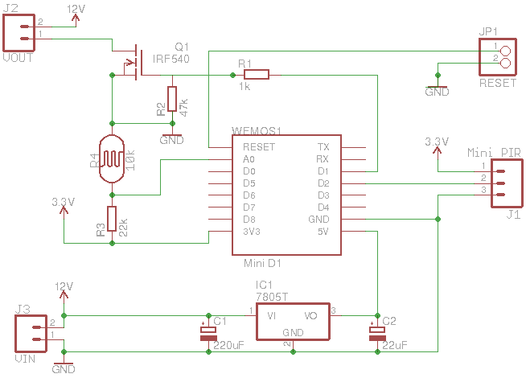

View this project on [CADLAB.io](https://cadlab.io/project/1212).

# Twilight
Twilight for ESP. A new spin on an old idea.

See [blog articles](https://programmablehardware.blogspot.ie/search?q=twilight).

## Requires:
- Arduino 1.8.9
- ESP8266 [Arduino core](https://github.com/esp8266/Arduino) 2.6.0
- Wemos [D1 Mini](https://wiki.wemos.cc/products:d1:d1_mini)
- [PubSubClient](https://pubsubclient.knolleary.net) 2.7
- [ArduinoJson](https://github.com/bblanchon/ArduinoJson) 6.13.0

## Features:
- Web [configuration](https://github.com/jscrane/WebConfiguredESP)
- [Domoticz](https://domoticz.com) integration via MQTT

## Circuit Diagram

